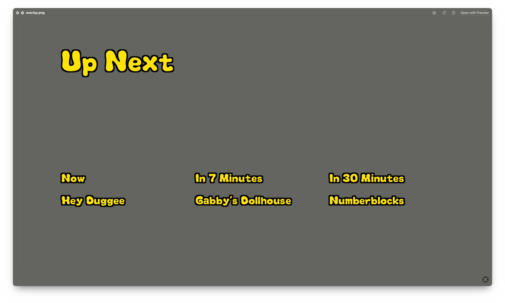
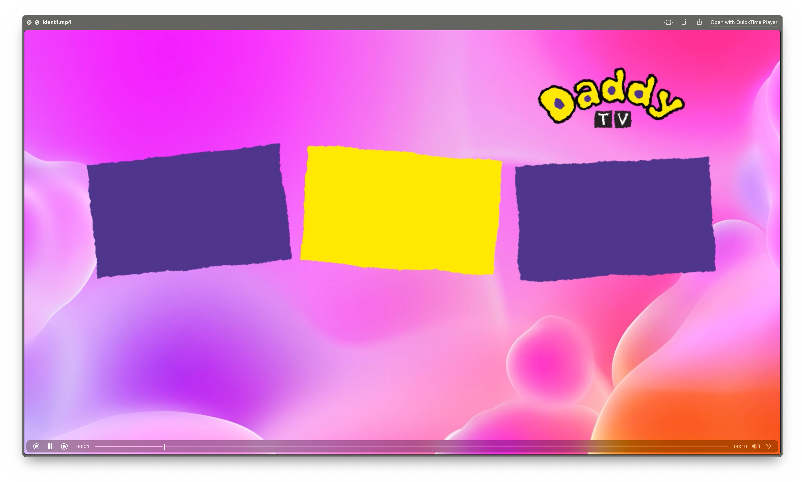
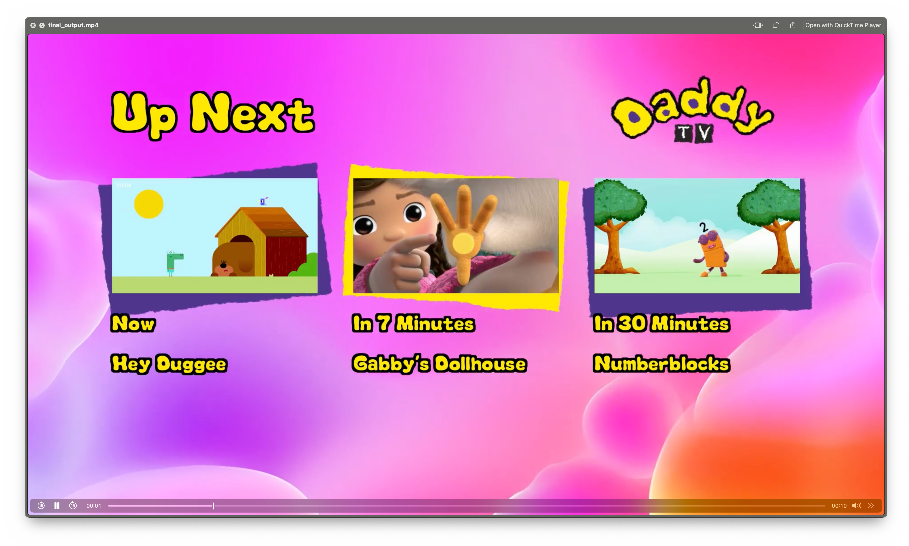

# ErsatzTV 'Up Next' Video Generator

This repo consists of two Python scripts that work together to generate 'Up Next' style videos that you can use in ETV. You'll need to do some manual work, but the two files are:

- **`clip_gen.py`**: Scans your ETV EPG, then your local media library, matches media files to upcoming programmes using fuzzy matching, and generates silent 10-second clips to be used as thumbnails. in the `programmes` directory. N.B. this isn't perfect but gets most. It ignores already created ones, so if you replace one manually it will stay there.
- **`up_next.py`**: Fetches programme data from the ETV EPG, generates an overlay png with the titles and times of upcoming programmes, and combines this with the above clips and a random file out of the `templates` directory to generate a single mp4 output file which updates after the end of each programme to generate a fresh MP4 for subsequent versions.

## Table of Contents

- [Features](#features)
- [Prerequisites](#prerequisites)
- [Installation](#installation)
- [Environment Variables / Config](#environment-variables)
- [Usage](#usage)
  - [Running the Clip Generator](#running-the-clip-generator)
  - [Running the Video Generator](#running-the-video-generator)
- [Directory Structure](#directory-structure)
- [Troubleshooting](#troubleshooting)

## Features

- **Automated Clip Generation**: Automatically extracts clips from your media files for upcoming programmes every hour, so picks up new dropped media.
- **Dynamic Overlay Creation**: Generates overlay images with programme information for subsequent 3 programmes.
- **Video Composition**: Combines the overlay, background template videos, and generated programme clips into a final video.
- **Scheduled Updates**: Both scripts run in loops to keep the content up-to-date.
- **Fuzzy Matching**: Utilizes fuzzy string matching to find the best match for programme titles in your media library.

## Prerequisites

- **Python 3.6 or higher**
- **Required Python Libraries**:
  - `Pillow` (`PIL`) for image processing
  - `Requests` for HTTP requests
  - `Rapidfuzz` for fuzzy string matching
  - `Dotenv` for environment vars
- **FFmpeg** installed and accessible in your system's PATH.
- **A TrueType font file** (e.g., I use `melt.otf` for kids programming) for text rendering.
- **Media Files**: A collection of your own local media files in supported formats (`.mp4`, `.mkv`, `.avi`, `.mov`).
- **Background Video Templates** in the specified (or `./templates/`) directory.
- A font file, you can download melt.otf [here](https://fontsgeek.com/fonts/Melt-LV1-Regular). 

## Installation

1. **Clone the repository**:

   ```bash
   git clone https://github.com/arobvs/etvupnext.git
   cd etvupnext
   ```

2. **Install the required Python packages**:

   ```bash
   pip install -r requirements.txt
   ```

3. **Install FFmpeg**:

   - **Windows**: Download FFmpeg from [FFmpeg Download](https://ffmpeg.org/download.html) and add it to your system's PATH.
   - **macOS**: Install via Homebrew:

     ```bash
     brew install ffmpeg
     ```

   - **Linux**: Install via your package manager, e.g., for Debian/Ubuntu:

     ```bash
     sudo apt-get install ffmpeg
     ```

## Environment Variables

To simplify configuration and secure sensitive information, the scripts support the use of environment variables for configurable paths and URLs. This approach enables you to keep your file paths, URLs, and other settings outside the code, making the scripts more portable and easier to configure across different environments.

### Setting Environment Variables

To set environment variables, you can define them in your shell, or place them in a `.env` file to be loaded automatically.

###  Environment Variables

| Variable Name          | Description                                       |
|------------------------|---------------------------------------------------|
| `XMLTV_URL`            | The local URL of the XMLTV file containing programme data.  |
| `MEDIA_FILES_DIR`      | Directory path where your media files are stored. |
| `PROGRAMMES_DIR`       | Directory where the programme clips are saved and accessed (these will be generated). |
| `TEMPLATE_DIR`         | Directory containing background template videos (you will need to make these).  |
| `OUTPUT_DIR`           | Optional path to specify where your output folder is |
| `FONT_PATH`            | Optional path to font file. |
| `OUTPUT_IMAGE`         | Optional path to output PNG image |
| `OUTPUT_VIDEO`         | Optional path to save final output video that will go into ETV. |
| `SUPPORTED_FORMATS`    | Optionally specify file formats (default is .mp4,.mkv,.avi,.mov) |
| `SCAN_INTERVAL`        | Optionally change the scan interval (default is an hour). |


### Setting Environment Variables in the Shell

To set environment variables temporarily in your shell, use the following commands:

```bash
# Required Variables
export XMLTV_URL="http://yourserver.com/path/to/xmltv.xml"
export MEDIA_FILES_DIR="/path/to/your/media/files"
export PROGRAMMES_DIR="./programmes/"

# Optional Variables
export TEMPLATE_DIR="./templates/"
export OUTPUT_DIR="./output/"
export FONT_PATH="./melt.otf"
export OUTPUT_IMAGE="./output/overlay.png"
export OUTPUT_VIDEO="./output/final_output.mp4"
export SUPPORTED_FORMATS=".mp4,.mkv,.avi,.mov"
export SCAN_INTERVAL=3600
```

**Note**: These variables will only be active for the duration of your session.

### Using a .env File

To persistently set environment variables, you can create a `.env` file in the same directory as your scripts. This file should contain key-value pairs for each environment variable:

```bash
# Required variables
XMLTV_URL="http://yourserver.com/path/to/xmltv.xml"
MEDIA_FILES_DIR="/path/to/your/media/files"
PROGRAMMES_DIR="./programmes/"

# Optional variables
TEMPLATE_DIR="./templates/"
OUTPUT_DIR="./output/"
FONT_PATH="./melt.otf"
OUTPUT_IMAGE="./output/overlay.png"
OUTPUT_VIDEO="./output/final_output.mp4"
SUPPORTED_FORMATS=".mp4,.mkv,.avi,.mov"
SCAN_INTERVAL=3600

```

To load the `.env` file in your Python script, add the following lines at the start of your script to automatically read the file and set the variables:

```python
from dotenv import load_dotenv
import os

# Load environment variables from .env file
load_dotenv()
```

The scripts are already assuming this option, so amend if necessary.

### Installing `python-dotenv`

To use `.env` files in your Python scripts, you’ll need the `python-dotenv` library. Install it using:

```bash
pip install python-dotenv
```

After adding these environment variables to your shell or `.env` file, the scripts will automatically use them, making it easy to change paths or URLs without modifying the code directly.

## Usage

### Running the Clip Generator

Run the `clip_gen.py` script to start generating clips from your media files:

```bash
python clip_gen.py
```

**What Happens**:

1) The script fetches the latest programme data from the XMLTV EPG.
2) It then scans your media files directory for media files.
3) It matches programmes from the EPG with your local media files using fuzzy matching.
4) It uses ffmpeg to extract random 10-second clips from matched media files and saves them in the `./programmes/` directory.
5) It then runs in an infinite loop, re-scanning every hour (or as configured) to generate new clips.

**Note**: Ensure that your media files are properly named to improve matching accuracy. Delete any rubbish ones and re-run/wait til it re-runs.

### Running the Video Generator

Run the `up_next.py` script to generate the promotional videos:

```bash
python up_next.py
```

**What Happens**:

- The script fetches the latest upcoming programmes from the XMLTV EPG.
- Calculates the timing for each programme (e.g., "Now", "In 30 Minutes").
- Generates a transparent static PNG overlay image with programme titles and timings.



- Selects a random background video with audio from the `./templates/` directory (create these yourself)



- Combines the overlay image, background video, and programme clips from the `./programmes/` directory into a final video.


  
- Saves the final video in the `./output/` directory.
- Waits until the next programme's start time plus a buffer before repeating the process.

## Directory Structure

```
up-next-video-generator/
├── clip_gen.py
├── up_next.py
├── melt.otf
├── templates/
│   ├── template1.mp4
│   ├── template2.mp4
│   └── ...
├── programmes/
│   ├── Generated Clip of Programme 1.mp4
│   ├── Generated Clip of Programme 2.mp4
│   └── ...
├── output/
│   ├── overlay.png
│   └── final_output.mp4
```

## Customisation

- **Adjusting Text Positions and Styles**: Modify the positions, fonts, colors, and sizes in the `create_overlay_image()` function of `up_next.py` to customise the appearance of the overlay.

## Troubleshooting

- **Missing Programme Clips**: If a programme clip is missing, the video generator will skip adding it to the final video. Ensure that the clip generator is running and that clips are being saved in the `./programmes/` directory.

- **Font Loading Issues**: If the video generator cannot find the font file, ensure the `font_path` is correct and the font file is accessible.

- **FFmpeg Errors**: Ensure FFmpeg is correctly installed and added to your system's PATH. Test by running `ffmpeg -version` in your command line.

- **Media File Matching Issues**: If the clip generator is not finding matches for your programmes, consider adjusting the fuzzy matching threshold in the `find_best_match()` function or renaming your media files to be more consistent.

- **Permissions**: Ensure that the script has the necessary permissions to read from the media files directory and write to the `./programmes/` and `./output/` directories.
